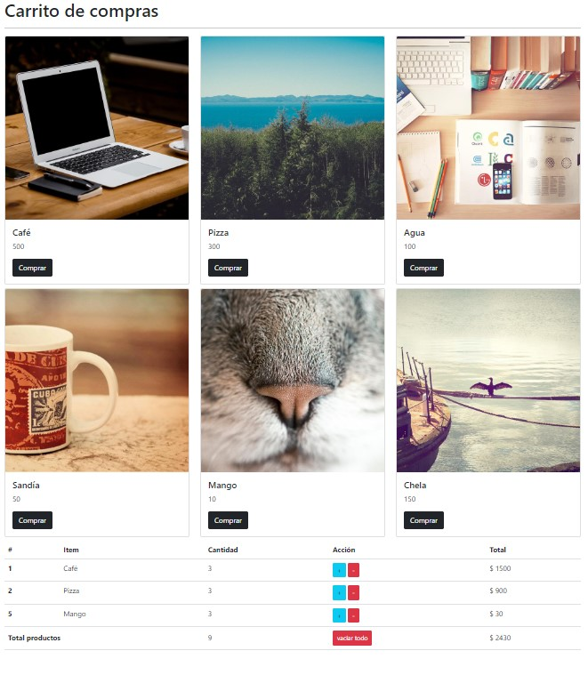

# Carrito de compras basico

Este proyecto presenta una interfaz para un carrito de compras basico. Se muestran los articulos mediante un grid de tres columnas, bajo los articulos aparece la tabla de articulo seleccionados. La informacion se almacena en localstorage.

## Vista previa

## Tecnologias utilizadas

* HTML
* BOOTSTRAP
* JAVASCRIPT

